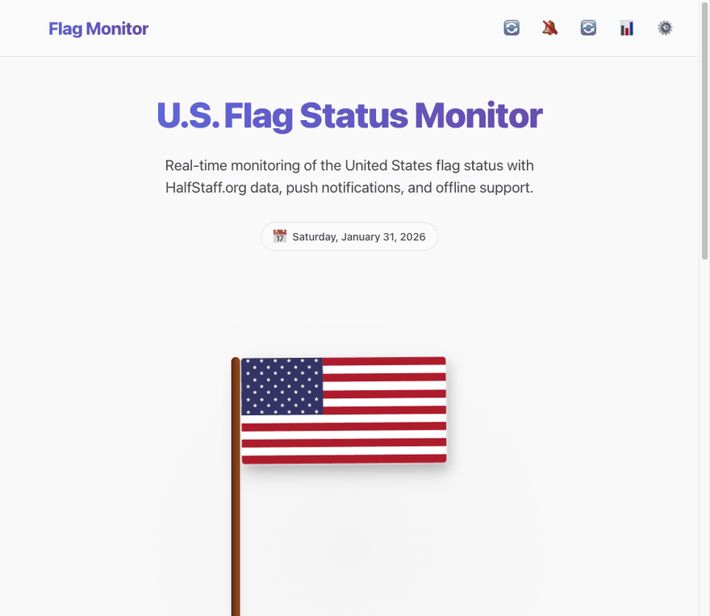

# 🇺🇸 Flag Status Monitor

**A real-time, installable PWA that tracks whether the U.S. flag is at full-staff or half-staff** — with live history, federal-holiday context, offline support, and zero backend infrastructure to run.

<div align="center">

[](https://github.com/jacob-booth/flag-status-monitor/actions/workflows/ci.yml)
[](https://github.com/jacob-booth/flag-status-monitor/actions/workflows/deploy.yml)
[](https://jacob-booth.github.io/flag-status-monitor/)
[](LICENSE)
[](package.json)

[**Live Demo**](https://jacob-booth.github.io/flag-status-monitor/) · [Report a Bug](https://github.com/jacob-booth/flag-status-monitor/issues) · [Request a Feature](https://github.com/jacob-booth/flag-status-monitor/issues)

</div>



---

## Overview

The U.S. flag is flown at half-staff on specific, often unannounced occasions — to mark a presidential proclamation, a national tragedy, or a memorial observance. **Flag Status Monitor** answers "is it at half-staff right now?" at a glance, then goes further: it explains _why_, surfaces the relevant section of the U.S. Flag Code, tracks history over time, and works offline once installed.

It's built as a fully static site — no server to provision, no database to manage — yet behaves like a real product: live status, push-style in-app notifications, a settings panel, keyboard shortcuts, and a polished, accessible UI in both light and dark mode.

## ✨ Features

|                                  |                                                                                                                                                          |
| -------------------------------- | -------------------------------------------------------------------------------------------------------------------------------------------------------- |
| 🔄 **Live status**               | Polls official sources on a schedule and shows the current staff position with context, the relevant Flag Code section, and the nearest federal holiday. |
| 🧭 **Federal & state scope**     | Switch between the federal flag status and all 50 states + D.C.                                                                                          |
| 📊 **History & stats**           | A searchable, filterable timeline of past status changes with at-a-glance stats (total changes, current streak).                                         |
| 🔔 **Smart notifications**       | In-app toasts and (with permission) browser notifications whenever the status changes, with quick actions to view history or share.                      |
| ⚙️ **Real settings panel**       | Theme, auto-refresh, and notification preferences — plus a one-click way to clear local data.                                                            |
| 📖 **Flag etiquette**            | The official U.S. Flag Code guidance, one tap away.                                                                                                      |
| 📱 **Installable PWA**           | Add-to-home-screen support with offline caching via a service worker — no stale "Lighthouse score" promises, just a real `sw.js` you can read.           |
| ♿ **Accessible by default**     | Semantic landmarks, skip link, live regions, full keyboard support, and `prefers-reduced-motion` / `prefers-contrast` handling.                          |
| 🌓 **Light / dark / auto theme** | Respects system preference, with a one-click override.                                                                                                   |

## 🖥️ Tech Stack

- **Vanilla JavaScript (ES2022 modules)** — no framework overhead for an app this size; component classes (`FlagDisplay`, `NotificationCenter`, `HistoryView`, `SettingsModal`, `Modal`) keep things organized without one.
- **Vite** — dev server + production bundling, with `base: './'` so the build is portable across GitHub Pages, custom domains, or a plain file preview.
- **Modern CSS** — custom properties, CSS Grid, `color-mix()`, and a single design-token source of truth (`src/css/styles.css`).
- **Service Worker** — runtime (not precache-list) caching, so it never goes stale against hashed build output.
- **Python** — a small, scheduled script (`src/api/check_status.py`) that checks HalfStaff.org / falls back to scraping usa.gov, and writes the result as static JSON.
- **Vitest** — unit tests for the pure utility modules (`flagInfo.js`, `storage.js`).
- **GitHub Actions** — CI (lint, format check, test, build) on every PR, and a build-then-deploy pipeline to GitHub Pages.

## 🚀 Quick Start

```bash
git clone https://github.com/jacob-booth/flag-status-monitor.git
cd flag-status-monitor
npm install
npm run dev      # http://localhost:3000
```

That's it — `public/api/*.json` is served directly by Vite's dev server, so there's no backend to start for normal frontend work.

### Other useful commands

```bash
npm run build          # production build to dist/
npm run preview        # preview the production build locally
npm test                # run the Vitest suite once
npm run test:watch      # run tests in watch mode
npm run lint            # ESLint
npm run format          # Prettier --write
npm run icons           # regenerate public/assets/icon-*.svg
npm run serve:mock      # optional: a dynamic Python mock API (see below)
```

### Optional: dynamic mock API

`server.py` is a small stdlib-only HTTP server that simulates a _dynamic_ backend (randomized status, manual overrides, pagination) — useful if you're prototyping backend behavior rather than just the frontend:

```bash
python3 server.py        # http://localhost:8000
```

It is **not** required for `npm run dev`.

## 📁 Project Structure

```
flag-status-monitor/
├── index.html                  # App shell / entry point
├── vite.config.js              # Build + dev server config (relative base, jsdom test env)
├── eslint.config.js            # Flat ESLint config
├── src/
│   ├── css/
│   │   ├── styles.css          # Design tokens, layout, hero, status card
│   │   └── components/         # modal.css, history.css, notifications.css
│   ├── js/
│   │   ├── main.js             # App bootstrap + global error handling
│   │   ├── FlagStatusApp.js    # Orchestrates state, components, and events
│   │   ├── components/         # FlagDisplay, HistoryView, NotificationCenter,
│   │   │                       #   SettingsModal, EtiquetteModal, Modal (shared base)
│   │   ├── config/constants.js # API config, themes, state list, storage keys
│   │   └── utils/               # api.js, storage.js, flagInfo.js (+ __tests__/)
│   └── api/check_status.py     # Scheduled status-checker (writes to public/api)
├── public/                      # Copied verbatim into dist/ by Vite
│   ├── api/status.json          # Canonical current status (single source of truth)
│   ├── api/history.json         # Canonical status history
│   ├── badge.json                # Shields.io endpoint badge data
│   ├── manifest.json, sw.js     # PWA manifest + service worker
│   └── assets/                  # Icons, favicons, demo media
├── server.py                     # Optional dynamic mock API for backend prototyping
├── generate-icons.mjs            # Regenerates the SVG icon set
├── adr/                          # Architecture Decision Records
└── .github/workflows/            # ci.yml, deploy.yml, update-flag-status.yml
```

There is intentionally **no `docs/` folder** committed to the repo — the previous version hand-maintained a duplicate copy of the entire app there for GitHub Pages, which drifted out of sync with `src/` over time. The build output (`dist/`) is now generated fresh by CI and deployed directly; see [`deploy.yml`](.github/workflows/deploy.yml).

## 🔄 How the data flows

1. **`update-flag-status.yml`** runs hourly (and on demand), invoking `src/api/check_status.py`.
2. The script checks HalfStaff.org's widget API, falling back to scraping usa.gov, and writes the result to `public/api/status.json`. If the status _changed_ since the last run, it also appends an entry to `public/api/history.json` and updates `public/badge.json` (used by the README badge above).
3. **`deploy.yml`** builds the site with Vite and publishes `dist/` to GitHub Pages — triggered both by pushes to `main` and by the status-update workflow completing.
4. In the browser, `src/js/utils/api.js` fetches those same JSON files (no hostname-sniffing — `import.meta.env.BASE_URL` makes the same code work locally, on a project Pages site, or behind a custom domain).

## ⌨️ Keyboard Shortcuts

| Shortcut       | Action                            |
| -------------- | --------------------------------- |
| `Ctrl/Cmd + R` | Refresh flag status               |
| `Ctrl/Cmd + T` | Cycle theme (light → dark → auto) |
| `Ctrl/Cmd + N` | Toggle notifications              |
| `Esc`          | Close any open modal              |

## ♿ Accessibility

- Semantic landmarks (`header`, `main`, `footer`) with a visible-on-focus skip link.
- Live regions (`aria-live`) for status, connection state, and toasts.
- Full keyboard operability for the flag display, modals, and history filters.
- Respects `prefers-reduced-motion` (disables flag-wave and transition animations) and `prefers-contrast: high`.
- Color choices target WCAG AA contrast in both themes.

## 🗺️ Roadmap

- [ ] Web Push (true background notifications, not just foreground toasts)
- [ ] CSV export from the History view
- [ ] Per-state historical accuracy (currently state scope proxies through HalfStaff.org's widget directly)
- [ ] i18n for Spanish-language users
- [ ] Lighthouse CI in the `ci.yml` workflow with tracked budgets

Contributions toward any of the above are very welcome — see below.

## 🤝 Contributing

1. Fork the repo and create a branch: `git checkout -b feature/your-idea`
2. `npm install && npm run dev`
3. Make your change, then run `npm run lint && npm test && npm run build` before opening a PR
4. Open a pull request describing what changed and why

Please keep PRs focused — small, reviewable changes are much easier to merge quickly.

## 📄 License

[MIT](LICENSE) © Jacob Booth. Flag status data is sourced from public government information and is not officially affiliated with any government agency.
