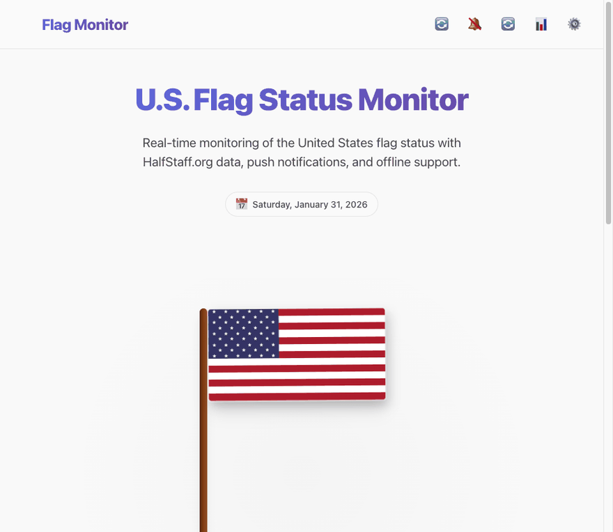

# 🇺🇸 Flag Status Monitor

**A real-time, installable PWA that tracks whether the U.S. flag is at full-staff or half-staff** — with live history, federal-holiday context, offline support, and zero backend infrastructure to run.

<div align="center">

[](https://github.com/jacob-booth/flag-status-monitor/actions/workflows/ci.yml)
[](https://github.com/jacob-booth/flag-status-monitor/actions/workflows/deploy.yml)
[](https://github.com/jacob-booth/flag-status-monitor/actions/workflows/status-health.yml)
[](https://jacob-booth.github.io/flag-status-monitor/)
[](LICENSE)
[](package.json)

[**Live Demo**](https://jacob-booth.github.io/flag-status-monitor/) · [Report a Bug](https://github.com/jacob-booth/flag-status-monitor/issues) · [Request a Feature](https://github.com/jacob-booth/flag-status-monitor/issues)

</div>



---

## Overview

The U.S. flag is flown at half-staff on specific, often unannounced occasions — to mark a presidential proclamation, a national tragedy, or a memorial observance. **Flag Status Monitor** answers "is it at half-staff right now?" at a glance, then goes further: it explains _why_, surfaces the relevant section of the U.S. Flag Code, tracks history over time, and works offline once installed.

It's built as a fully static site — no server to provision, no database to manage — yet behaves like a real product: multi-source verification, visible data freshness, automatic deployments, status-change notifications while the app is open, keyboard shortcuts, and an accessible UI in both light and dark mode.

## ✨ Features

|                                  |                                                                                                                                                |
| -------------------------------- | ---------------------------------------------------------------------------------------------------------------------------------------------- |
| 🛡️ **Cross-checked status**      | Resolves reviewed orders, White House actions, breaking reports, and HalfStaff.org with visible confidence and per-source results.             |
| ⚡ **Autonomous publishing**     | Checks every 15 minutes, commits verified transitions, and deploys changed status data directly to GitHub Pages.                               |
| 🟢 **Freshness at a glance**     | Shows when sources were last checked and clearly changes from Verified → Check delayed → Data stale.                                           |
| 🧭 **Federal & state scope**     | Switch between the federal flag status and all 50 states + D.C.                                                                                |
| 📊 **Verified history & stats**  | A sourced, filterable timeline backfilled to December 2024, with overlap-safe ordered-day and current-run calculations.                        |
| 🔔 **Status-change alerts**      | In-app toasts and, with permission, browser notifications while the monitor is open.                                                           |
| ⚙️ **Real settings panel**       | Theme, auto-refresh, and notification preferences — plus a one-click way to clear local data.                                                  |
| 📖 **Flag etiquette**            | The official U.S. Flag Code guidance, one tap away.                                                                                            |
| 📱 **Installable PWA**           | Add-to-home-screen support with offline caching via a service worker — no stale "Lighthouse score" promises, just a real `sw.js` you can read. |
| ♿ **Accessible by default**     | Semantic landmarks, skip link, live regions, full keyboard support, and `prefers-reduced-motion` / `prefers-contrast` handling.                |
| 🌓 **Light / dark / auto theme** | Respects system preference, with a one-click override.                                                                                         |

## 🖥️ Tech Stack

- **Vanilla JavaScript (ES2022 modules)** — no framework overhead for an app this size; component classes (`FlagDisplay`, `NotificationCenter`, `HistoryView`, `SettingsModal`, `Modal`) keep things organized without one.
- **Vite** — dev server + production bundling, with `base: './'` so the build is portable across GitHub Pages, custom domains, or a plain file preview.
- **Modern CSS** — custom properties, CSS Grid, `color-mix()`, and a single design-token source of truth (`src/css/styles.css`).
- **Service Worker** — runtime (not precache-list) caching, so it never goes stale against hashed build output.
- **Python** — a multi-source resolver (`src/api/check_status.py`) that prioritizes reviewed and official orders, handles source outages safely, and writes auditable static JSON.
- **Vitest + unittest** — frontend utility coverage plus resolver, expiry, outage, history-integrity, and transition tests.
- **GitHub Actions** — CI on every PR, scheduled status resolution, direct Pages deployment after data changes, and end-to-end production health checks.

## 🚀 Quick Start

```bash
git clone https://github.com/jacob-booth/flag-status-monitor.git
cd flag-status-monitor
npm install
npm run dev      # http://localhost:3000
```

That's it — `public/api/*.json` is served directly by Vite's dev server, so there's no backend to start for normal frontend work.

### Other useful commands

```bash
npm run build          # production build to dist/
npm run preview        # preview the production build locally
npm test                # run the Vitest suite once
npm run test:watch      # run tests in watch mode
npm run lint            # ESLint
npm run format          # Prettier --write
npm run icons           # regenerate public/assets/icon-*.svg
npm run serve:mock      # optional: a dynamic Python mock API (see below)
```

### Optional: dynamic mock API

`server.py` is a small stdlib-only HTTP server that simulates a _dynamic_ backend (randomized status, manual overrides, pagination) — useful if you're prototyping backend behavior rather than just the frontend:

```bash
python3 server.py        # http://localhost:8000
```

It is **not** required for `npm run dev`.

## 📁 Project Structure

```
flag-status-monitor/
├── index.html                  # App shell / entry point
├── vite.config.js              # Build + dev server config (relative base, jsdom test env)
├── eslint.config.js            # Flat ESLint config
├── src/
│   ├── css/
│   │   ├── styles.css          # Design tokens, layout, hero, status card
│   │   └── components/         # modal.css, history.css, notifications.css
│   ├── js/
│   │   ├── main.js             # App bootstrap + global error handling
│   │   ├── FlagStatusApp.js    # Orchestrates state, components, and events
│   │   ├── components/         # FlagDisplay, HistoryView, NotificationCenter,
│   │   │                       #   SettingsModal, EtiquetteModal, Modal (shared base)
│   │   ├── config/constants.js # API config, themes, state list, storage keys
│   │   └── utils/               # api.js, storage.js, flagInfo.js (+ __tests__/)
│   └── api/
│       ├── check_status.py     # Multi-source resolver (writes to public/api)
│       ├── known_orders.json   # Reviewed time-bounded order registry
│       └── verified_history.json # Official historical backfill
├── public/                      # Copied verbatim into dist/ by Vite
│   ├── api/status.json          # Canonical current status (single source of truth)
│   ├── api/history.json         # Canonical status history
│   ├── badge.json                # Shields.io endpoint badge data
│   ├── manifest.json, sw.js     # PWA manifest + service worker
│   └── assets/                  # Icons, favicons, demo media
├── server.py                     # Optional dynamic mock API for backend prototyping
├── generate-icons.mjs            # Regenerates the SVG icon set
├── adr/                          # Architecture Decision Records
└── .github/workflows/            # CI, deploy, updater, and production health checks
```

There is intentionally **no `docs/` folder** committed to the repo — the previous version hand-maintained a duplicate copy of the entire app there for GitHub Pages, which drifted out of sync with `src/` over time. The build output (`dist/`) is now generated fresh by CI and deployed directly; see [`deploy.yml`](.github/workflows/deploy.yml).

## 🔄 How the data flows

1. **`update-flag-status.yml`** is scheduled every 15 minutes and can also run on demand.
2. The resolver checks reviewed active orders, the verified schedule, recent White House proclamations, strict nationwide breaking-order headlines, and HalfStaff.org.
3. Positive orders are priority-resolved; full-staff requires a negative provider signal; time-bounded active orders survive temporary source outages without being retained past expiration.
4. The workflow writes `status.json`, merges reviewed records into `history.json`, updates the badge, commits only changed data, then builds and deploys that exact revision to GitHub Pages.
5. **`status-health.yml`** checks that repository data is fresh and that the live status signature and history count match `main`.
6. The browser fetches JSON with cache busting and `no-store`, then refreshes every five minutes—or every minute around an active or imminent order.

## Reliability model

- **Evidence is visible:** the dashboard exposes confidence, primary source, order window, check age, and every monitored source result.
- **No indefinite emergencies:** retained half-staff data must have a future expiration.
- **No fabricated history:** refreshes never create records; a reviewed registry replaces weaker duplicates captured during breaking events.
- **No double-counting:** overlapping national orders count each affected calendar day once.
- **No silent deployment drift:** the updater deploys its own changed data, and a separate health workflow compares production with `main`.
- **Honest degradation:** source failures are surfaced as unavailable, while stale data is visibly labeled in the UI.

## ⌨️ Keyboard Shortcuts

| Shortcut       | Action                            |
| -------------- | --------------------------------- |
| `Ctrl/Cmd + R` | Refresh flag status               |
| `Ctrl/Cmd + T` | Cycle theme (light → dark → auto) |
| `Ctrl/Cmd + N` | Toggle notifications              |
| `Esc`          | Close any open modal              |

## ♿ Accessibility

- Semantic landmarks (`header`, `main`, `footer`) with a visible-on-focus skip link.
- Live regions (`aria-live`) for status, connection state, and toasts.
- Full keyboard operability for the flag display, modals, and history filters.
- Respects `prefers-reduced-motion` (disables flag-wave and transition animations) and `prefers-contrast: high`.
- Color choices target WCAG AA contrast in both themes.

## 🗺️ Roadmap

- [ ] Web Push (true background notifications, not just foreground toasts)
- [ ] CSV export from the History view
- [ ] Per-state historical accuracy (currently state scope proxies through HalfStaff.org's widget directly)
- [ ] i18n for Spanish-language users
- [ ] Lighthouse CI in the `ci.yml` workflow with tracked budgets

Contributions toward any of the above are very welcome — see below.

## 🤝 Contributing

1. Fork the repo and create a branch: `git checkout -b feature/your-idea`
2. `npm install && npm run dev`
3. Make your change, then run `npm run lint && npm test && npm run build` before opening a PR
4. Open a pull request describing what changed and why

Please keep PRs focused — small, reviewable changes are much easier to merge quickly.

## 📄 License

[MIT](LICENSE) © Jacob Booth. Flag status data is sourced from public government information and is not officially affiliated with any government agency.
