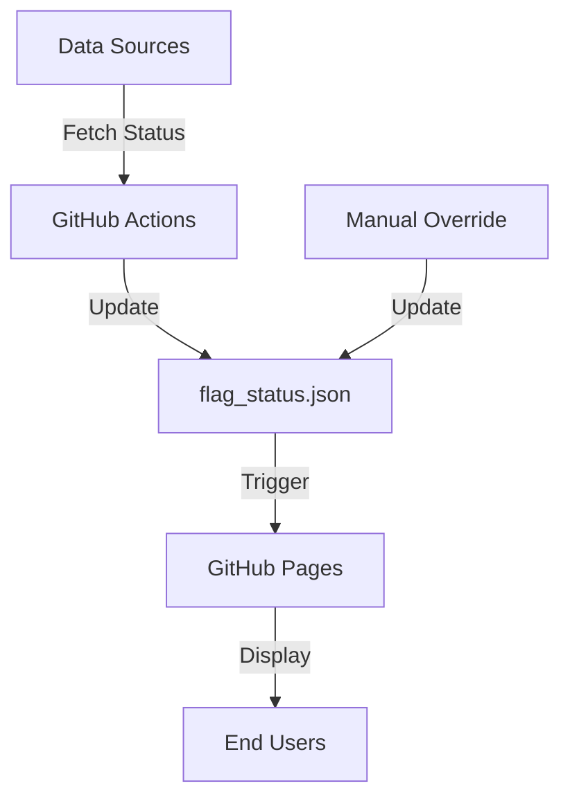

# Flag Status Monitoring System - Architecture Documentation

## System Overview

The Flag Status Monitoring System is a distributed system that automatically tracks and displays U.S. flag status (full-staff or half-staff) through multiple components working together. This document outlines the architectural decisions and system design.

## Architecture Principles

1. **Reliability First**: Multiple data sources with fallback mechanisms
2. **Real-Time Updates**: Push-based updates when flag status changes
3. **Separation of Concerns**: Clear boundaries between data collection, processing, and display
4. **Fail-Safe Design**: Manual override capability for exceptional cases
5. **Security by Design**: Protected API keys and authenticated manual overrides

## System Components

### 1. Data Collection Service
- **Purpose**: Fetches flag status from multiple sources
- **Implementation**: Python script running on GitHub Actions
- **Key Features**:
  - Priority-based source checking
  - Error handling with fallback sources
  - Rate limiting compliance
  - Logging of all status changes

### 2. Data Storage
- **Purpose**: Maintains current and historical flag status
- **Implementation**: JSON files in GitHub repository
- **Key Features**:
  - Version controlled status changes
  - Audit trail through Git history
  - Simple, human-readable format

### 3. Frontend Display
- **Purpose**: Visual representation of current flag status
- **Implementation**: Static website with dynamic updates
- **Key Features**:
  - Animated flag display
  - Real-time status updates
  - Mobile-responsive design

## Data Flow

## API Integration Strategy

### Primary Sources (In Order of Priority)
1. U.S. Office of Personnel Management (OPM) API
2. State Government APIs
3. Third-Party Flag Status API
4. Web Scraping Fallback

### Error Handling Strategy
- 5-second timeout for each API call
- Cascade through sources until valid response
- Log failed attempts for monitoring
- Default to last known status if all sources fail

## Security Architecture

### API Key Management
- Stored as GitHub Secrets
- Never exposed in code or logs
- Rotated regularly

### Manual Override Security
- Requires GitHub authentication
- Limited to specific team members
- All changes logged and reviewed

## Monitoring and Maintenance

### Health Checks
- API response monitoring
- Status change notifications
- Error rate tracking

### Maintenance Tasks
- Weekly source verification
- Monthly API key rotation
- Quarterly security review

## Technical Decisions

### Why GitHub Actions?
1. Built-in scheduling capabilities
2. Free for public repositories
3. Integrated with version control
4. Reliable infrastructure

### Why Static Site Hosting?
1. High availability
2. Zero maintenance overhead
3. Fast global content delivery
4. Cost effective

## Future Considerations

### Scalability
- Support for state-specific flag statuses
- Additional data sources integration
- Historical status analytics

### Reliability
- Implement status verification system
- Add automated testing
- Enhance monitoring capabilities

## Development Guidelines

### Version Control
- Feature branches for all changes
- Pull request reviews required
- Semantic versioning for releases

### Code Standards
- PEP 8 for Python code
- ESLint for JavaScript
- Automated code formatting

### Documentation
- Inline code documentation
- API documentation
- Setup and maintenance guides

## Deployment Strategy

### Initial Deployment
1. Repository setup with core files
2. GitHub Actions configuration
3. API integration testing
4. Frontend deployment

### Continuous Deployment
- Automated deployments on status changes
- Manual deployments for code updates
- Staged rollouts for major changes

## System Requirements

### Minimum Requirements
- Python 3.9+
- Node.js 14+ (for local development)
- GitHub account with Actions enabled

### Recommended Tools
- VS Code with Python and JavaScript extensions
- Git command line tools
- API testing tools (e.g., Postman)

## Risk Mitigation

### Data Accuracy
- Multiple source verification
- Manual override capability
- Status change notifications

### System Availability
- GitHub Pages uptime
- API fallback mechanisms
- Cached last known status

### Security Risks
- Regular security audits
- Dependency updates
- Access control reviews