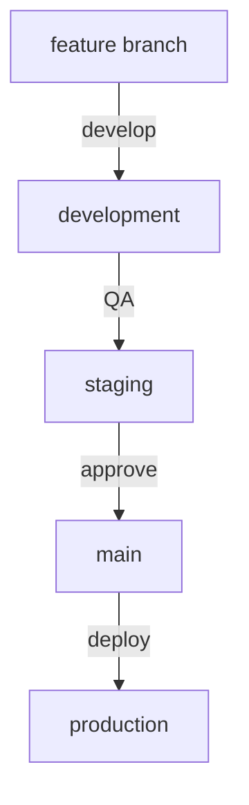

# Flag Status Monitoring System - Implementation Roadmap

## Overview
This document outlines the phased implementation approach for the Flag Status Monitoring System, providing guidelines and milestones for development teams.

## Phase 1: Foundation (Weeks 1-2)

### Repository Setup
- [ ] Initialize GitHub repository
- [ ] Configure branch protection rules
- [ ] Set up GitHub Actions environment
- [ ] Configure security scanning
- [ ] Establish initial documentation

### Core Infrastructure
- [ ] Set up GitHub Pages
- [ ] Configure GitHub Actions workflows
- [ ] Implement basic CI/CD pipeline
- [ ] Set up security monitoring

### Data Source Integration
- [ ] Implement OPM API client
- [ ] Add state government API clients
- [ ] Configure third-party API integration
- [ ] Set up web scraping fallback
- [ ] Implement source priority system

## Phase 2: Core Features (Weeks 3-4)

### Status Management
- [ ] Implement status fetcher
- [ ] Add validation system
- [ ] Create caching layer
- [ ] Set up error handling
- [ ] Add logging system

### Frontend Development
- [ ] Create basic website structure
- [ ] Implement flag animation
- [ ] Add status display
- [ ] Set up automatic updates
- [ ] Add basic error handling

### Manual Override System
- [ ] Create override interface
- [ ] Implement authentication
- [ ] Add audit logging
- [ ] Set up approval workflow
- [ ] Add notification system

## Phase 3: Enhancement (Weeks 5-6)

### Monitoring & Alerts
- [ ] Set up health checks
- [ ] Implement alert system
- [ ] Add performance monitoring
- [ ] Create status dashboard
- [ ] Configure error reporting

### Security Hardening
- [ ] Implement RBAC
- [ ] Add API key rotation
- [ ] Set up secret scanning
- [ ] Configure access logging
- [ ] Add security monitoring

### Data Analytics
- [ ] Add status history
- [ ] Implement basic analytics
- [ ] Create reporting system
- [ ] Add trend analysis
- [ ] Set up data exports

## Phase 4: Optimization (Weeks 7-8)

### Performance
- [ ] Optimize API calls
- [ ] Enhance caching
- [ ] Improve load times
- [ ] Add CDN integration
- [ ] Optimize animations

### Reliability
- [ ] Add automated testing
- [ ] Implement chaos testing
- [ ] Enhance error recovery
- [ ] Add redundancy
- [ ] Improve failover

### User Experience
- [ ] Add mobile optimization
- [ ] Enhance accessibility
- [ ] Improve animations
- [ ] Add user preferences
- [ ] Enhance documentation

## Development Guidelines

### Code Standards
```yaml
standards:
  python:
    style: PEP 8
    linter: pylint
    formatter: black
  
  javascript:
    style: Airbnb
    linter: ESLint
    formatter: Prettier
  
  typescript:
    config: strict
    linter: TSLint
    formatter: Prettier
```

### Git Workflow


### Testing Requirements
1. Unit tests (80% coverage minimum)
2. Integration tests
3. End-to-end tests
4. Performance tests
5. Security tests

### Documentation Requirements
1. API documentation
2. Setup guides
3. Maintenance procedures
4. Security protocols
5. User guides

## Success Criteria

### Technical Metrics
- 99.9% uptime
- <1s response time
- <5min recovery time
- 0 security incidents
- 100% data accuracy

### User Metrics
- Zero false status reports
- <1s status update time
- Mobile-friendly score >90
- Accessibility score >90
- Zero user complaints

## Maintenance Plan

### Regular Tasks
- Daily monitoring review
- Weekly security scan
- Monthly performance audit
- Quarterly security review
- Annual architecture review

### Emergency Procedures
1. Incident response plan
2. Rollback procedures
3. Communication templates
4. Escalation paths
5. Recovery checklists

## Resource Requirements

### Development Team
- 1 Tech Lead
- 2 Full-stack Developers
- 1 DevOps Engineer
- 1 QA Engineer

### Infrastructure
- GitHub Enterprise
- CI/CD pipeline
- Monitoring tools
- Testing infrastructure
- Documentation system

## Risk Management

### Technical Risks
1. API availability
2. Data accuracy
3. Performance issues
4. Security vulnerabilities
5. Integration failures

### Mitigation Strategies
1. Redundant sources
2. Automated validation
3. Performance monitoring
4. Security scanning
5. Automated testing

## Success Metrics

### System Health
- Uptime percentage
- Response times
- Error rates
- Recovery times
- Update frequency

### User Experience
- Load times
- Animation smoothness
- Mobile responsiveness
- Accessibility scores
- User feedback

## Conclusion
This roadmap provides a structured approach to implementing the Flag Status Monitoring System. Teams should use this as a guide while maintaining flexibility to adapt to changing requirements and challenges.